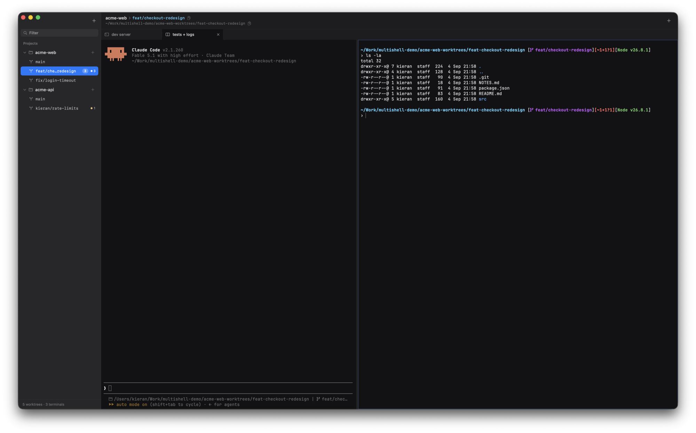

# Multishell

A native terminal workspace for people who work in many git worktrees at
once. Projects on the left, their worktrees under them, and terminal tabs
(with splits) for whichever worktree is selected. Terminals keep running while
you look at other worktrees.

macOS now. The core is portable and CI builds it on Linux.

## Quick start

    sudo xcode-select -s /Applications/Xcode.app   # once, if only CLT is active
    make run          # or: make install, then open it from /Applications

Add a repository with the `+` in the sidebar. Right-click a project for its
settings; Cmd+, for app settings.

## Read next

- [DEVELOP.md](DEVELOP.md): building, testing, where things live, how to add
  a platform or an engine.
- [DESIGN.md](DESIGN.md): the decisions behind the shape of the code and the
  behaviour of the app, and why.

## Status

Early and unshipped. Nothing is signed or notarised, and only macOS has a
GUI.

## How it was written

Every line of code in this repository was written by an AI (Claude), under
direction from a human who set the requirements, reviewed the results in the
running app, and sent it back when something was wrong. The design decisions
in DESIGN.md were argued out in that conversation, and the tests were written
to pin behaviour the human had actually exercised. It is not vibe-coded: the
architecture, the trade-offs and what shipped were human calls.

## License

GNU Affero General Public License v3.0. See [LICENSE](LICENSE).
