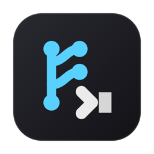
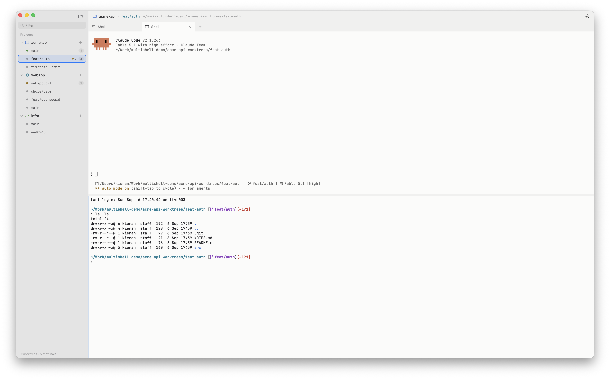
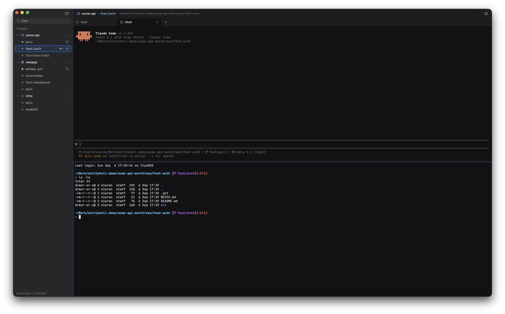

  

<h1 align="center">Multishell</h1>

  A native macOS terminal workspace for people who work in many git worktrees at once, 
  built for running coding agents side by side.

  Projects on the left, their worktrees under them, terminal tabs and splits for the one you have selected. 
  Every terminal keeps running while you look at another worktree, and a dot on each tab and row says what it is doing.

  
  

## Install

Requires macOS with Xcode 26 and `git` on your `PATH`.

    git clone https://github.com/KieranP/multishell.git
    cd multishell
    sudo xcode-select -s /Applications/Xcode.app   # once, if only the command line tools are active
    make signing-identity                          # once per machine, so privacy grants survive a rebuild
    make install                                   # release build into /Applications

`make run` builds and opens a debug copy that keeps its own state, so it
sits beside an installed one. The first build downloads libghostty, about
80 MB. Then add a repository with the folder button at the top of the
sidebar, or Cmd+O.

**Agent hooks.** For the state dots to follow an agent, it has to report
through its hooks. Open Settings > Agents, where every agent on your PATH
that has them — Claude Code, Codex, Gemini CLI, Copilot CLI and OpenCode —
gets a row with Add. Where the file is the agent's own, Multishell appends
one entry per event, leaves the rest of it as it is, keeps a copy beside it
the first time, and Remove takes only its own entries out again; where the
agent reads a directory of hook files, or a plugin, it writes a file of its
own and deletes it again. Codex asks you to trust a new hook once, with
`/hooks`. Plain shell commands report without any of this. Until an agent's
hooks are in, nothing it does reaches the app, so its dots never move and the
Agents board stays empty.

To work on it, start with [DEVELOP.md](DEVELOP.md) for the build, the tests
and the rules CI enforces, and [DESIGN.md](DESIGN.md) for why things are the
way they are.

## Features

- Projects in a sidebar, every git worktree under them, terminal tabs and
  splits per worktree. Drag a tab to the edge of the terminal area and it
  gets a column of its own, so two agents in one worktree are watched side by
  side. Terminals keep running while you look elsewhere, and a tab dragged
  onto another worktree's row moves there without restarting.
- Create a worktree and its branch in one step, where the project says, and
  it opens with a terminal, or your agent, already running. Removing one
  moves it to the Trash, so a wrong click is recoverable.
- Give a new worktree the files git does not carry: one list of paths copied
  into it, another symlinked back to the repository, so `.env` comes along
  and `node_modules` is shared instead of installed again.
- A state dot on every tab and worktree: working, waiting for input, done,
  failed. Five agents report through their hooks; zsh and bash report plain
  commands with no setup; any tool can through `multishell state`, which
  also takes `--agent` to say which agent is at that pane's prompt.
- An Agents entry above the projects, opening a board of every terminal with
  an agent at its prompt: one card each, in a column for what it is doing —
  waiting for you, working, done, idle — carrying the project and worktree it
  is in, how long it has been there and the last thing it said. Click a card
  to land in that pane. A Dock badge counts the ones waiting, and a toggle
  brings in plain shells, which report through the same columns.
- Pick a preferred agent and open it in a tab with one shortcut, or have
  every new tab start it. Optional notifications when a tab you are not
  looking at needs you.
- Drop files from Finder onto a terminal: an agent whose prompt reads
  mentions gets them as `@` mentions relative to the worktree, a shell gets
  quoted paths. Nothing is run — you press Return.
- Dirty-file badges, ahead/behind counts, and a badge when a branch has
  landed, from git calls that never take the index lock and never fetch on
  a timer.
- Sort worktree rows by name, creation or last commit, busy ones first if
  you like, with the trunk pinned to the top; filter them, and name one
  yourself over the branch it still is.
- Pre- and post-create and delete hooks per project, run through your own
  shell, with a timeout and a Cancel button in the pane rather than a
  blocking sheet.
- A `.multishell.json` a repository can commit with its path, prefix, file
  lists, hooks and icon. Hooks from someone else's run only after you have
  said yes; the lists, which run nothing, apply straight away.
- Bare clones with worktrees beside them work as projects.
- Ghostty or SwiftTerm as the terminal, themes as plain JSON that colour the
  whole window, a font picker, Open in Editor, and a click in the prompt
  that moves the cursor (Ghostty only).
- Nothing written to your shell's rc files, and state that survives an
  older or newer build.

## Status

Early and unshipped. A build signs itself with a self-signed local
certificate, so the permissions you grant it survive a rebuild, but nothing
is notarised and the bundle runs only on the machine that built it until the
libghostty resource lookup is fixed (see Known gaps in DEVELOP.md). Only
macOS has a GUI, and only macOS is built in CI; the core keeps to Foundation
so another frontend can use it, but nothing compiles it without one.

Every line of code in this repository was written by an AI (Claude), under
direction from a human who set the requirements, reviewed the results in the
running app, and sent it back when something was wrong. The design decisions
in DESIGN.md were argued out in that conversation, and the tests were written
to pin behaviour the human had actually exercised. It is not vibe-coded: the
architecture, the trade-offs and what shipped were human calls.

## License

GNU Affero General Public License v3.0. See [LICENSE](LICENSE).
