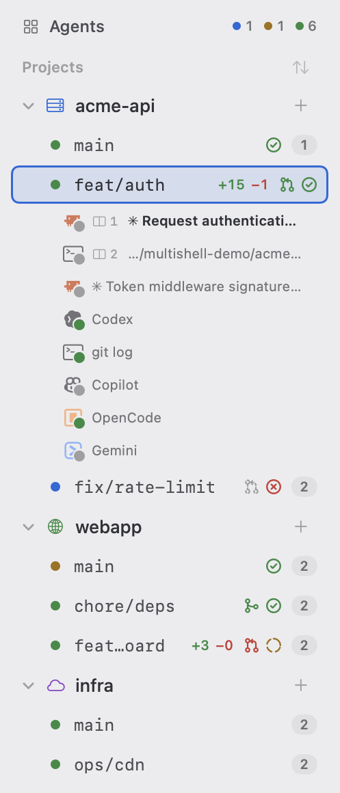
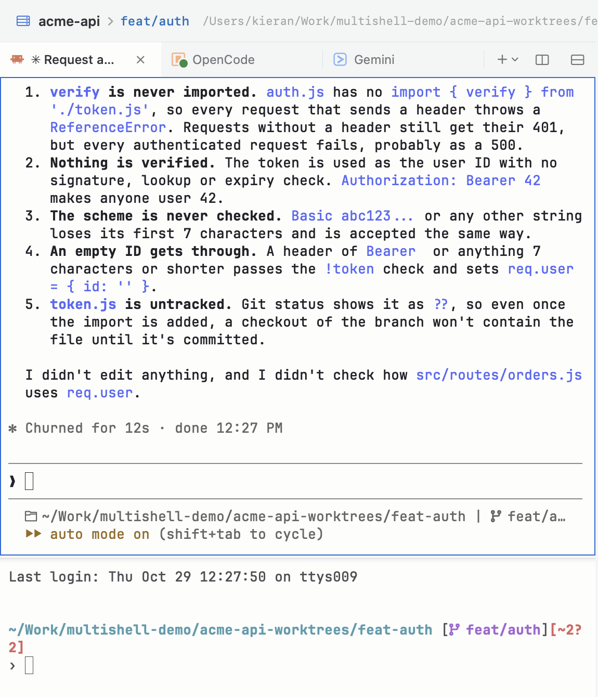
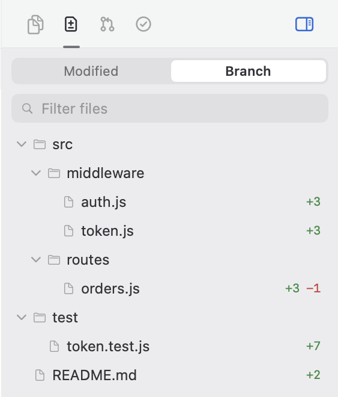

<p align="center">
  
</p>

<h1 align="center">Multishell</h1>

<p align="center">
  A native macOS terminal for running coding agents across many git worktrees at once.
</p>

<p align="center">
  <a href="https://github.com/KieranP/multishell/actions/workflows/ci.yml"></a>
  
  <a href="LICENSE"></a>
</p>

<p align="center">
  <a href="#install">Install</a> ·
  <a href="#features">Features</a> ·
  <a href="COMPAT.md">Compatibility</a> ·
  <a href="#contributing">Contributing</a>
</p>

<p align="center">
  <picture>
    <source media="(prefers-color-scheme: dark)" srcset="Docs/screenshot-dark.png">
    
  </picture>
</p>

Five agents in five worktrees usually means five terminal windows and no idea
which one is waiting on you. Multishell puts every project and worktree in one
sidebar. Pick one and its tabs, splits and agents fill the window. Switch away
and they keep running, with a dot on each tab and row saying which agents are
working, waiting on you, or done.

<!-- prettier-ignore -->
> [!NOTE]
> There is no notarised release yet. Multishell builds from source in a few
> commands; see [Install](#install).

## Why Multishell

- **Agents run in a real terminal.** Each one is its own CLI in a libghostty
  pane, so its slash commands and keys work as they do anywhere else.
- **A worktree per task.** Each agent gets its own branch, checkout, ports and
  environment files, so two of them never share a checkout or bind the same
  port.
- **You see who needs you.** Dots on every tab and row, an Agents board, a Dock
  badge and notifications. ⌘P opens on the agents waiting on you, longest first.
- **Native and local.** Swift, SwiftUI and AppKit, not Electron. No account and
  no telemetry. The app makes no network calls of its own, and agents use your
  own logins.

## Features

<table>
<tr>
<td width="45%" valign="middle">
<h3>Every worktree, and what its agents are doing</h3>
Each project has its own symbol and colour, with its worktrees and their tabs
under it. A dot says working, waiting on you, done or failed. Rows add the lines
changed, the branch's pull request and its latest CI run.
</td>
<td width="55%" align="center">
<picture>
  <source media="(prefers-color-scheme: dark)" srcset="Docs/screenshot-sidebar-dark.png">
  
</picture>
</td>
</tr>
<tr>
<td width="45%" valign="middle">
<h3>Terminals that keep running</h3>
Tabs, splits and side-by-side groups per worktree, drawn by libghostty. Every
terminal keeps running while you look at another worktree, and a tab dragged to
another worktree moves without restarting.
</td>
<td width="55%">
<picture>
  <source media="(prefers-color-scheme: dark)" srcset="Docs/screenshot-panes-dark.png">
  
</picture>
</td>
</tr>
<tr>
<td width="45%" valign="middle">
<h3>See what the branch changed</h3>
Modified counts from <code>HEAD</code>. Branch counts from where the branch left
its base, so an agent's commits stay listed. Files open read-only beside the
terminals, with the diff unified or side by side.
</td>
<td width="55%" align="center">
<picture>
  <source media="(prefers-color-scheme: dark)" srcset="Docs/screenshot-git-dark.png">
  
</picture>
</td>
</tr>
</table>

### Agents

- **The agent you already use.** Claude Code, Codex, Gemini CLI, Copilot CLI and
  OpenCode, each with its own icon on its tab, or any command you name.
- **An Agents board** of every running agent, with a chip counting the subagents
  and background shells each has out.
- **A Dock badge** for the agents waiting on you, and **notifications** for tabs
  you are not looking at, toggled per state.
- **Your preferred agent** one shortcut away, with its flags set globally or per
  project.
- **Sessions resume.** Saved agent tabs pick up their session on the next
  launch.

### Worktrees

- **A branch and worktree in one step**, with a shell or agent already running
  in it. Bare clones work too.
- **Rows show ahead and behind**, and a badge once the branch has landed. Sort,
  filter and rename them.
- **`.env`, `node_modules` and the like** copied or symlinked into each new
  worktree.
- **Hooks before and after create and remove**, shared with your team in
  `.multishell.json`.
- **A block of ports per worktree**, in `MULTISHELL_PORT` and `{{port}}`, so dev
  servers in two worktrees never collide.
- **Auto Rename** asks an agent's CLI to name a worktree from its branch's
  changes. No API key, and the git branch keeps its name.
- **Removing a worktree moves it to the Trash**, or deletes it if you prefer.

### Pull requests and CI

- **Read through `gh` and `circleci`**, both optional, with a popover on the row
  and full pages in the side panel.
- **Create Pull Request** pushes the branch after asking, then opens GitHub's
  page for it.
- **Settings > Integrations** shows each tool's version and login, and turns
  either off per project.

### Terminals and files

- **Themes colour the whole window.** Multishell's light and dark, ten editor
  ports such as Dracula, Nord and Catppuccin, or your own in JSON.
- **Drop or paste files** onto a terminal as `@` mentions or quoted paths. A
  copied image is saved to a file and pasted the same way.
- **Click in the prompt** to move the cursor there.
- **Syntax highlighting follows embedded code**, such as a Svelte file's scripts
  and styles or a Markdown fence in the language it names.
- **Arrows in a file tab** step from one change to the next.
- **Your shell rc files are never edited.**

### Keyboard

| Keys | Action                                                         |
| ---- | -------------------------------------------------------------- |
| ⌘P   | Go to any agent, worktree, tab, project or file, waiting first |
| ⇧⌘P  | Run any menu command                                           |
| ⌘N   | New worktree                                                   |
| ⌥⌘T  | New tab with your preferred agent                              |
| ⇧⌘T  | New shell tab                                                  |
| ⌘D   | Split right                                                    |
| ⇧⌘D  | Split down                                                     |
| ⌥⌘G  | Move the tab to a new group                                    |
| ⇧⌘A  | Agents board                                                   |
| ⌘F   | Find in the pane or file                                       |
| ⇧⌘O  | Open the worktree in your editor                               |

### Scripting

The `multishell` command drives the app: projects, worktrees, tabs, panes,
settings and screenshots. Multishell's own terminals have it on their `PATH`,
and Settings > Agents > Hooks > Install Command Line Tool links it into
`/usr/local/bin`.

```sh
multishell tabs open WORKTREE_ID --agent claude --prompt "Plan the auth fix"
multishell panes wait PANE_ID --state done
multishell state running --message "building"   # set this tab's dot from any script
```

`multishell help` lists every command. View > Enable Debug Tools shows frame
rate, CPU, memory and git timings.

## Install

You need:

- macOS 26 Tahoe or later
- Xcode 26 or later (Swift 6.2), not only the command line tools
- the Zig version Ghostty pins, `zig@0.17` today
- `git` on your `PATH`

Set up the toolchain once, and again after each Xcode update. Skip
`xcode-select` if Xcode is already the active developer directory.

```sh
brew install zig@0.17                          # Scripts/build-ghostty.sh --zig-version names the version
sudo xcode-select -s /Applications/Xcode.app
sudo xcodebuild -license
sudo xcodebuild -runFirstLaunch
xcodebuild -downloadComponent MetalToolchain
```

Then clone, build and install into `/Applications`:

```sh
git clone https://github.com/KieranP/multishell.git
cd multishell
make signing-identity   # once per machine, so macOS keeps your permission grants across rebuilds
make install
```

The first build compiles libghostty from the `ThirdParty/ghostty` submodule,
which takes a minute or two. Open Multishell and add a repository with the
folder button at the top of the sidebar, or ⌘O.

<details>
<summary>Debug builds and build trouble</summary>

- `make run` builds and opens a debug copy with its own state, so it can run
  beside the installed one.
- If a build fails after a pull that moved files, run `make clean` once.
- If it stops because the submodule is past its pin, run
  `git submodule update ThirdParty/ghostty`.

The full build notes are in [Docs/develop/build.md](Docs/develop/build.md).

</details>

### Agent hooks

zsh, bash and fish report their state with no setup. Agents report through their
own hooks, so their dots stay still until you add them:

1. Open Settings > Agents > Hooks.
2. Click Add beside each agent. Multishell adds its entries to the agent's
   config, keeping a copy of the file the first time, or writes a file of its
   own. Remove takes out only what it added.
3. In Codex, trust the new hooks once with `/hooks`.

[COMPAT.md](COMPAT.md) lists every file Multishell touches and how far each
shell and agent goes.

## Status

- macOS 26 and later, built and run on Apple silicon. Intel is untested.
- English only.

Every line of code was written by an AI (Claude), directed by a human who set
the requirements and reviewed the results in the running app. The design
decisions under `Docs/design/` were argued out in that conversation; the
architecture, the trade-offs and what shipped were human calls.

## Contributing

Start with [AGENTS.md](AGENTS.md), which indexes `Docs/develop/` for the build,
tests and rules, and `Docs/design/` for why things are the way they are. Pull
requests are from collaborators only, as [CONTRIBUTING.md](CONTRIBUTING.md)
explains. Issues are open to anyone. Report a vulnerability through
[SECURITY.md](SECURITY.md) instead of an issue.

## License

Copyright (C) 2026 Kieran Pilkington. GNU Affero General Public License v3.0;
see [LICENSE](LICENSE). Third party notices are in
[THIRD-PARTY-NOTICES.md](THIRD-PARTY-NOTICES.md).
